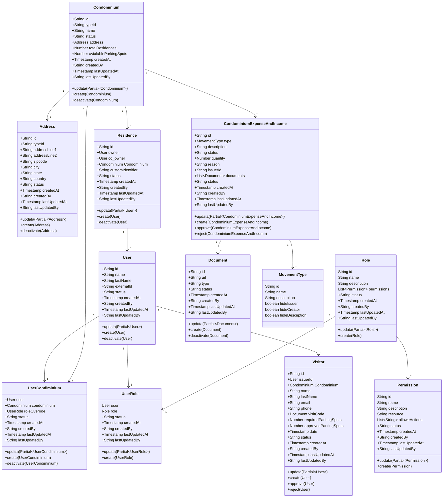

# Database

The proposed database structure is intended to hold the relations on between users and condominiums.

The following structure is planned for hosting permissions 'in house' but tables as `Role`, `Permission`, `UserRole` and the attribute `roleOverride` of `UserCondiminium` can be ommited if using an external permission service such as [Permit](https://permit.io/).

This diagram does not take in consideration authorization info such as `session` or `password` as from creation this is intended to be managed by an external service as [Clerk](https://clerk.com/)

To understand this diagran is important to know tha:

- an user can be asigned to multiple condominiums
- a condominium have multiple ways of make expenses and incomes
- each movement have an issuer an a creator
- regarding the movement type, one or many fields may have to be hidden for privacy.
- each movement need to have at least one document as proof
- if a movement is created by owner, co_owner or guard it needs appovar of hoa_merber, resident, accountant or administrator
- when owner, co_owner creates a visitor and requires parking spots it needs approval from hoa_merber, resident, accountant or administrator for those spots
- a visitor is alway approved and get a qr to get access to condominium
