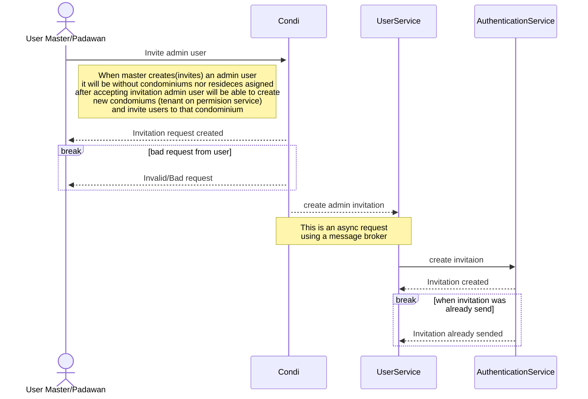
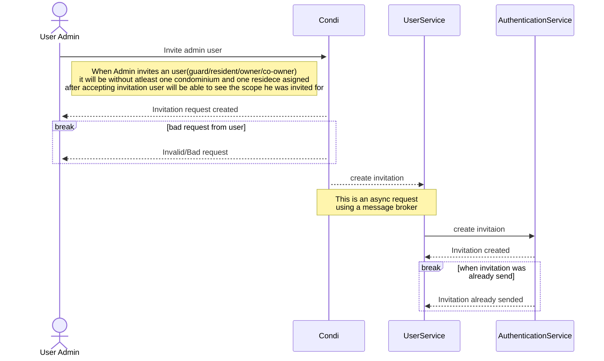

# Creating a new user

To create a new user it has to options.

## User with role MASTER creates an ADMIN

When an master/padawan user create an admin user, this admin user will be created without assigned tenant as the admin will have the ability to create it's own tenants, also this will bring the ability to assing the admin to an existing tenant after admin accepts invitation. You will find the request to create a new admin user in the api docs or in postman example collection.

## User with role ADMIN creates any role with lower hierarchy

When an admin user creates an user with lower hierarchy, this user will be created with at least an assigned tenant an optional an residence assigned to the user(this wil be in case of owner/co_owner).

