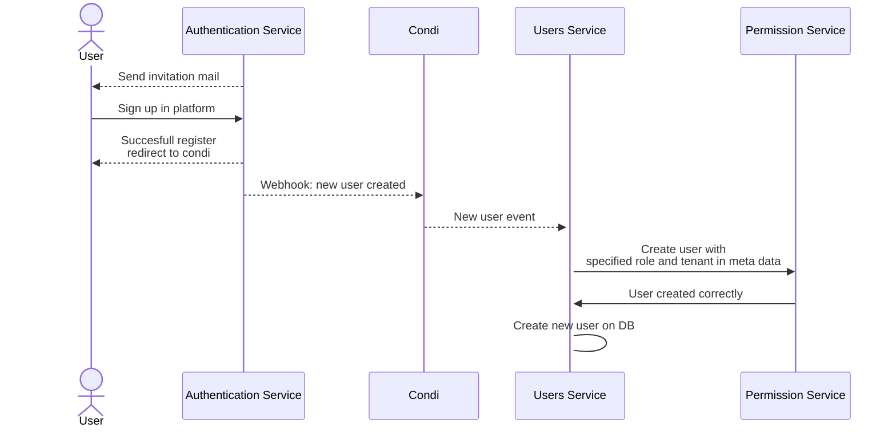

# User accept invitation

After a user is invited to use condi, he will get an invitation email with a link where he would be able to sign up to the application.

After the user register on authentication service, this service with notify Condi(our gateway) of the new user, this will create a new event that user service is listening to, when reciving the event, user service will create the user on permission service with the permission and scope defined on metadata of user.
